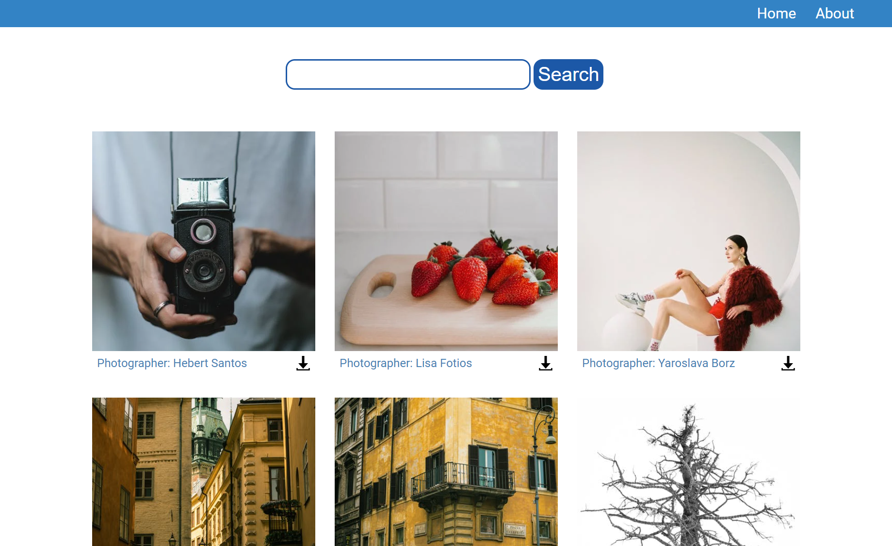
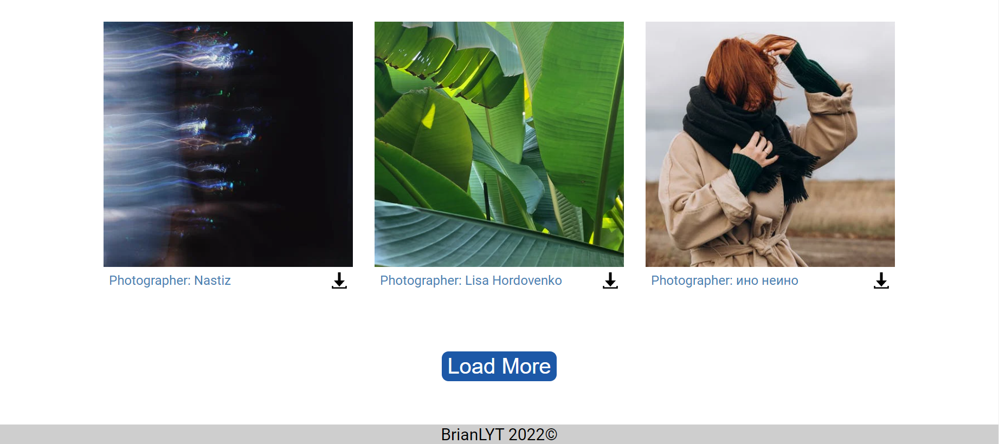

# Photo_Website
[](https://opensource.org/licenses/MIT)

## Description

An photo website built with React, users can search for a variety of high quality photos.

* features:
  * React for displaying UI components
  * Photos from the api of the [Pexels](https://www.pexels.com/) website 
  
### Home  




## Install
```
$ git clone https://github.com/BrianLYT/Photo_Website.git
```
## Setup
```
 Create .env file that include:

  * REACT_APP_PEXELS_AUTH <Your Pexels API>

```
## Requirements

- react@17.0.2
- react-router-dom@5.2.0
- dotenv@16.0.0  


## Run
```
$ npm start
```

## Technologies Used

- [React](https://reactjs.org/): A JavaScript library for building user interfaces.
 
## License
MIT License  

[](https://opensource.org/licenses/MIT)

Copyright (c) 2022 BrianLYT

Permission is hereby granted, free of charge, to any person obtaining a copy
of this software and associated documentation files (the "Software"), to deal
in the Software without restriction, including without limitation the rights
to use, copy, modify, merge, publish, distribute, sublicense, and/or sell
copies of the Software, and to permit persons to whom the Software is
furnished to do so, subject to the following conditions:

The above copyright notice and this permission notice shall be included in all
copies or substantial portions of the Software.

THE SOFTWARE IS PROVIDED "AS IS", WITHOUT WARRANTY OF ANY KIND, EXPRESS OR
IMPLIED, INCLUDING BUT NOT LIMITED TO THE WARRANTIES OF MERCHANTABILITY,
FITNESS FOR A PARTICULAR PURPOSE AND NONINFRINGEMENT. IN NO EVENT SHALL THE
AUTHORS OR COPYRIGHT HOLDERS BE LIABLE FOR ANY CLAIM, DAMAGES OR OTHER
LIABILITY, WHETHER IN AN ACTION OF CONTRACT, TORT OR OTHERWISE, ARISING FROM,
OUT OF OR IN CONNECTION WITH THE SOFTWARE OR THE USE OR OTHER DEALINGS IN THE
SOFTWARE.
